# How blockchain can make a real difference
Imagine if every citizen had the confidence that philanthropic commitments to support societal challenges such as extreme poverty were being honored. That resources were in fact filtering down to the people with the greatest needs. That every dollar donated and spent was making a real impact. Wouldn’t a more transparent system motivate people to more readily champion worthy causes? Or better yet, inspire them to donate more themselves?
Complete this pattern to build a simple blockchain network using Hyperledger Fabric, on which cause-specific pledges and fund transfers are made by the government, registered with aid organizations, and validated by Global Citizen.

Audience level: Intermediate Developers

## Prerequisites

1. Free [IBM Cloud account](https://ibm.biz/Bd2t6h)
2. The VirtualBox image containing Hyperledger Fabric and all other pre-reqs to complete this pattern
3. VirtualBox 6.x

Once VirtualBox 6.x is installed on your environment, double-click on the `Hyperledger Fabric.ova` file and accept the defaults to import it into VirtualBox.

## Overview
The image below gives a high level overview of the scenario described above and will form the basis of our demo application. This idea is taken from the 'Tracking Donations with blockchain' code pattern and modified so that it can also be deployed to the IBM Blockchain Platform V2.0 service

  

The application to support the above process involves a frontend, a business service and a smart contract. The smart contract will have as asset the cause-specific pledge (called the project pledge) and the transactions: `createProjectPledge`, `sendPledgeToGlobalCitizen`, `sendPledgeToGovOrg`, `updatePledge` and `transferFunds`. The business service implements the logic to support the transactions and finally exposes them as RESTful endpoints. The business service communicates with the smart contract via the Hyperledger Fabric SDK. The transaction invoked on the smart contract updates the ledger. All this is depicted in the schematic overview below.

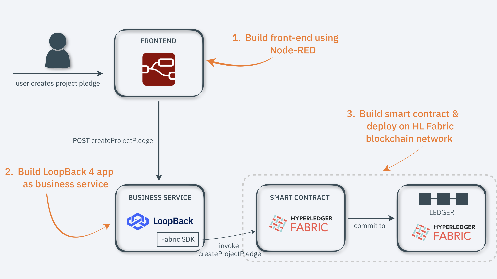  

As you can see in the image, building this demo application consists of three major steps. The fourth and last step is connecting all parts.

## Steps
1. [Build a frontend in Node-RED](#1-build-a-front-end-in-node-red)
2. [Build the Business Service](#2-build-the-business-service)
3. [Build the Smart Contract](#3-build-the-smart-contract)
4. [Connecting all parts](#4-connecting-all-parts)

## 1. Build a front-end in Node-RED
Logon to IBM Cloud using the free account you just created. Next, click the 'Catalog' on the top bar (1) and then search for Node-RED (2). Finally, click on the starter kit Node-RED Starter.

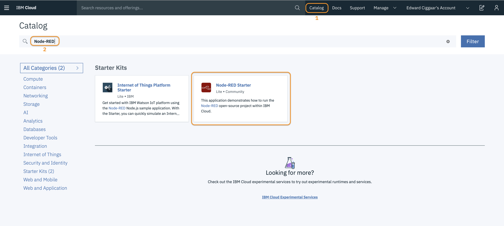  

Give the service a unique name (1) and select a nearby region to deploy to (e.g. London or Frankfurt). Click 'Create' (2) to create the service. 

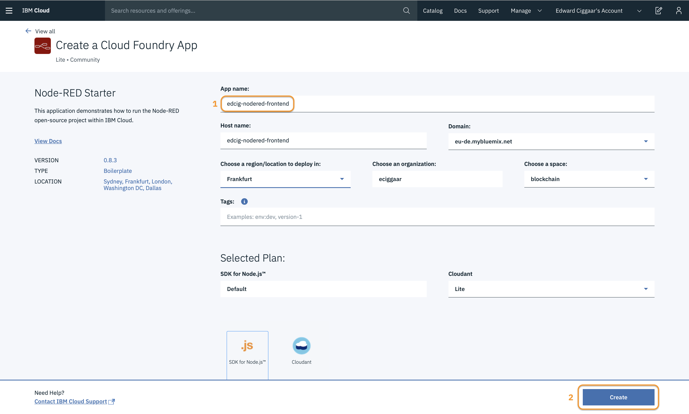

The deployment takes a couple of minutes to complete, so you might want to move on to part 2 and start the creation of your business service and return later to complete the setup of your frontend.

Once the deployment is successfully completed, visit the app URL by clicking (1) on the image below.


Next, complete the Node-RED initial set-up wizard. Click Next on the first screen and choose a userid/password on the second one to secure your Node-RED environment. Click Next (2) and Next again to go to the final overview page of the wizard. Click Finish to complete it. 

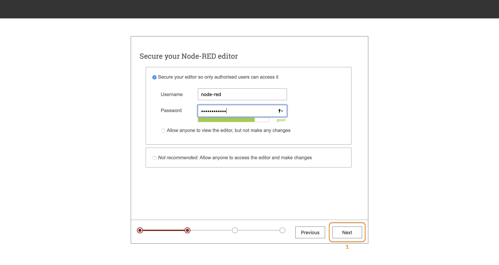

On the welcome page click on the 'Go to your Node-RED flow editor' button.


Login with your Node-RED credentials (the userid/password you specified in the wizard). You are presented with the drawing canvas, that you'll need to create your Node-RED flows. As we are developing a frontend, we need UI nodes. Unfortunately, these are not present by default so we need to add them. For this, click the menu on the top right (1) and select 'Manage palette' (2).


Next, click Install (1) and type 'dashboard' in the search bar. Click Install (3) to start the installation of the Node-RED dashboard nodes. 


Once the installation successfully completes, click 'Close' to close the palette. The dashboard nodes are available to you as a separate section on the left-hand side. You might need to scroll down to see them.

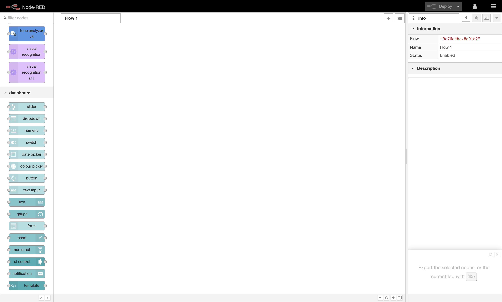

For now, this completes the first step. You just created a Node-RED application on IBM Cloud that serves as frontend and that is ready to consume some REST services...

## 2. Build the Business Service

The business service is generated using the LoopBack framework. Two generators are used, the application generator and the OpenAPI generator. The latter generates the models and controllers that are needed by the business service and that are defined in the included `openapi.json` file. For this part of the pattern you need to start the VirtualBox image. Once the image is completely up and running, open a terminal session. 


The first step is to change directory to the `Development` folder and to clone the following git repository. 

```
cd ~/Development
git clone https://github.com/eciggaar/hlfabric-lab-code
```

This will download the necessary code snippets (needed to complete this guide) to your VirtualBox environment. At the command prompt of the terminal session, make sure your current directory is the `Development` folder and type:

```
lb4 ibm-tnw2019-bc
```

This invokes the application generator and generates a basic LoopBack application with the name `ibm-tnw2019-bc`. Hit <Enter> to accept the defaults. Once the basic application has been generated, change directory into the `ibm-tnw2019-bc` folder and invoke the OpeAPI generator to complete the set-up of our business service.

```
cd ~/Development/ibm-tnw2019-bc
lb4 openapi --url ../hlfabric-lab-code/business-service/openapi.json --validate true
```

Again, accept all defaults. The second command generates the models and controllers needed for the business service. They are defined in the `openapi.json` file. Browse to the `hlfabric-lab-code` folder to manually inspect the JSON file. You'll see definitions for the project pledge asset as well as transactions like `createProjectPledge` and `transferFunds`.

Finally, the skeleton for the business service can be tested by typing `npm start` (current directory should be `ibm-tnw2019-bc`).

```
npm start
```

Now open a browser session and browse to [http://localhost:3000/explorer](http://localhost:3000/exlorer). This gives an overview of all available REST endpoints of our business service. 

Try to invoke one of the endpoints (e.g. createProjectPledge) by clicking on the service (1). Next, click 'Try it' (2) and provide some sample values (3). Finally, click 'Execute' (4) to submit the request and test the service. 

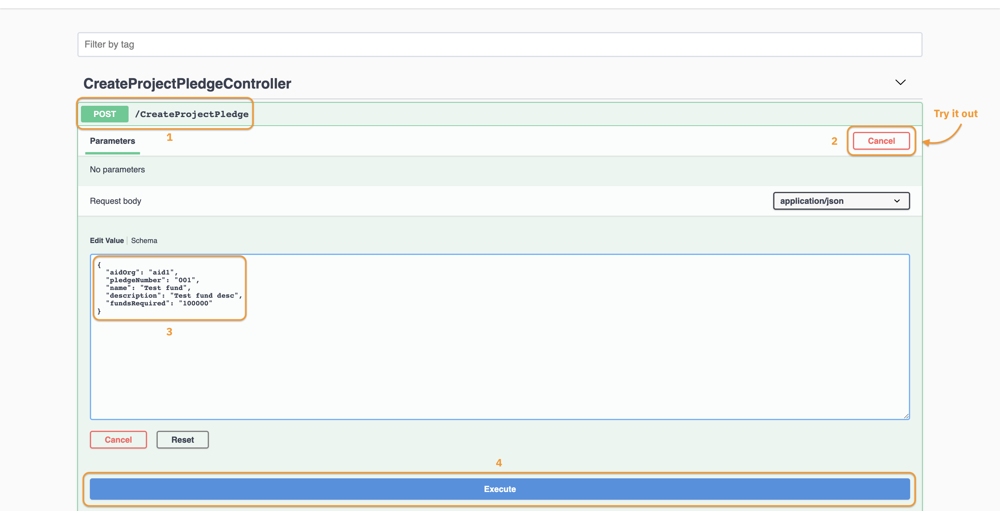

The response will be a 500 internal server error. The reason for this is, that this is the current implementation of the service. It throws exactly this error message.

```ts
/**
 * The controller class is generated from OpenAPI spec with operations tagged
 * by CreateProjectPledgeController
 * 
 */
export class CreateProjectPledgeController {
  constructor() {}

  /**
   * 
   * 

   * @param requestBody 
   * @returns ResponseMessage model instance
   */
  @operation('post', '/CreateProjectPledge')
  async createProjectPledgeCreate(@requestBody() requestBody: CreateProjectPledge): Promise<ResponseMessage> {
    throw new Error('Not implemented');
  }

}
```

It is our job to implement the business service in a meaningful way. This is done in Part 4 of this pattern, but first we have to develop the smart contract.

## 3. Build the Smart Contract

Typically, business rules that need to be executed --- before a transaction can be recorded on the blockchain --- are captured in a so-called smart contract, also referred to as chaincode in Hyperledger Fabric. As this is an important part of our application, it is good to get familiar with the basics of smart contract development in Hyperledger Fabric. For this, we will follow the beginner tutorial that is part of the IBM Blockchain extension in Visual Code. After you completed the tutorial you should have a better understanding of how to develop and debug smart contracts, but also of how to deploy them to your network. The IBM blockchain extension itself is built to provide developers an integrated workflow for building blockchain applictions. To get started with the tutorial, click on the Visual Code launcher in your VirtualBox image.

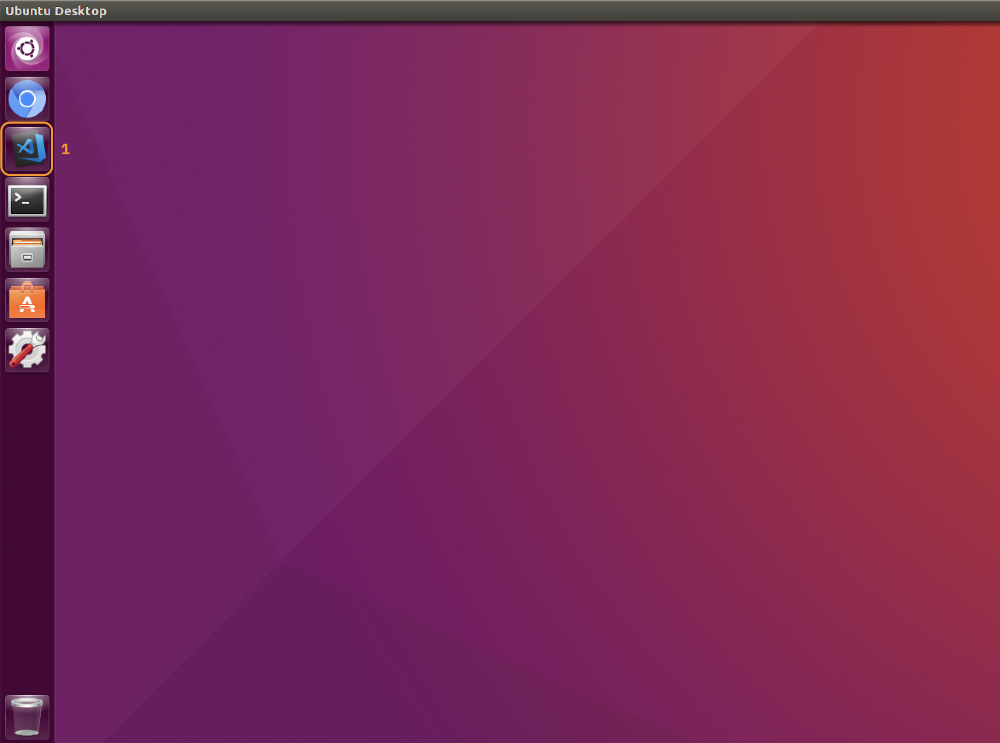

Next, click the IBM Blockchain extension on the left-hand side (1), followed by the blockchain icon on the top right (2). This opens the IBM Blockchain Platform welcome page. On this page, click the 'Beginner tutorial' link (3) to start the tutorial.


At this point, you have completed the tutorial and gained basic knowledge on smart contract development. The next step is to build the smart contract for the tracking donations use case. For this, add the `smart contract` sub-folder from the `hlfabric-lab-code` repository to your workspace in Visual Code. Your workspace should look similar to.

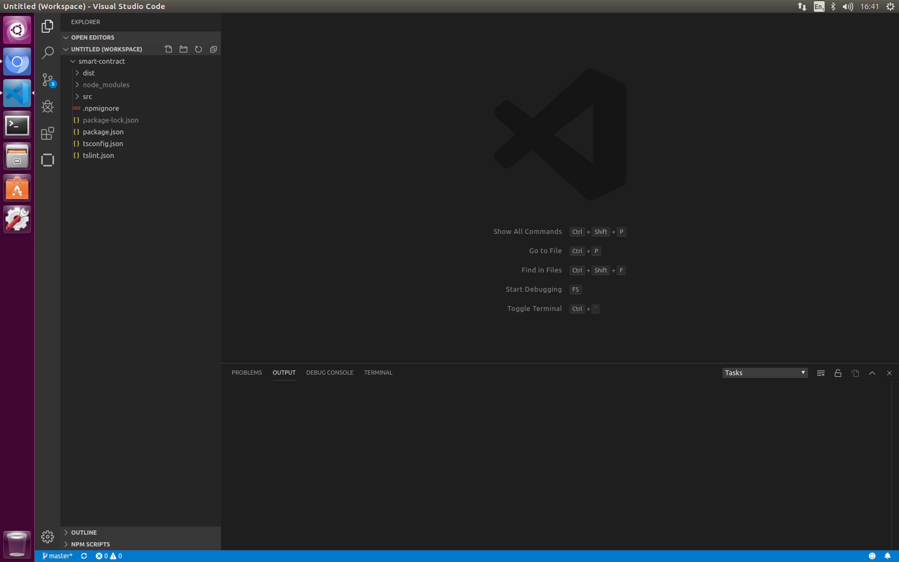

Now inspect the `smart contract` folder. The structure of the project is similar to the one from the tutorial. There are 2 assets and 5 transactions. The transactions are defined and implemented in the file `src/my-projectpledge-contract.ts`. Take a look at the `createProjectPledge` transaction.

```ts
    @Transaction()
    async createProjectPledge(ctx: Context, aidOrg: string, pledgeNumber: string, name: string, description: string, fundsRequired: number): Promise<void> {
        const pledgeId = aidOrg + ':' + pledgeNumber;
        const exists = await this.projectPledgeExists(ctx, pledgeId);

        if (exists) {
            throw new Error(`The project pledge ${pledgeId} already exists`);
        }

        // create an instance of the project pledge
        let pledge = new ProjectPledge();

        pledge.pledgeNumber = pledgeNumber;
        pledge.aidOrg = aidOrg;
        pledge.name = name;
        pledge.description = description;
        pledge.fundsRequired = fundsRequired;
        pledge.status = ppState.INITIALSTATE;

        const buffer = Buffer.from(JSON.stringify(pledge));
        await ctx.stub.putState(pledgeId, buffer);
    }
```

The `@Transaction()` method decorator is used to indicate that the function actually transacts on the blockchain. Functions that are only reading from the ledger have the decorator `@Transaction(false)`. Inside the function is checked whether a project pledge with the given pledgeId already exists. If not, a new project pledge asset is constructed based on the values from the input parameters. Finally, the project pledge is converted to a buffer and submitted to the blockchain by calling `ctx.stub.putState`. Now, have a close look at the other functions in `src/my-projectpledge-contract.ts` so that you understand the different transactions involved. 

The above transactions are always related to a given project pledge -- the asset. So, in our contract we have one main asset -- which is defined in `src/projectpledge.ts` -- and a supporting funding asset (`src/funding.ts`). Have a close look at both files. You'll see that they are both decorated with the `@Object()` method decorator and that they define the attributes (properties) of the asset.

```ts
/*
 * SPDX-License-Identifier: Apache-2.0
 */

import { Object, Property } from 'fabric-contract-api';

@Object()
export class Funding {
    /**
     *
     */
    @Property()
    fundingType: 'WEEKLY' | 'MONTHLY' | 'SEMIANNUALY' | 'ANNUALY';
  
    /**
     *
     */
    @Property()
    nextFundingDueInDays: number;

    :
    :

```

The last part of this section is to deploy the smart contract to our blockchain network. For this, open the IBM Blockchain extension in your Visual Code editor by clicking the blockchain icon on the left-hand side (1). Next, in the Smart Contract Packages panel, select the Options (2) and click 'Package a Smart Contract' (3).

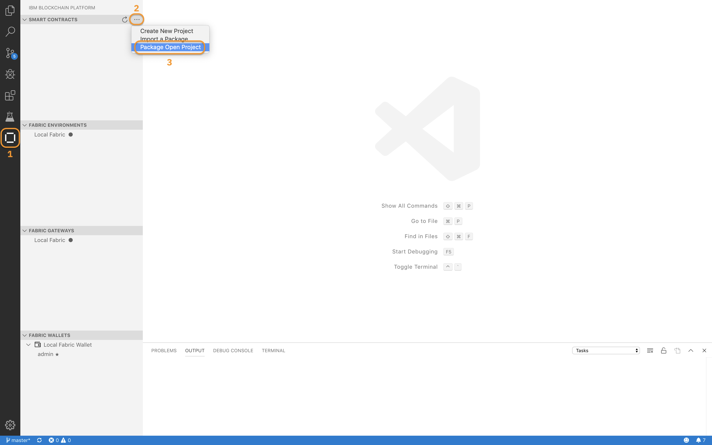

Next, choose your `smart-contract` folder as workspace folder to package (1). 


The result should be a `global-citizen@0.0.1` package under the Smart Contract Packages view. The final step in this section is to test whether the smart contract was successfully deployed. For this, click on the contract in the Fabric Gateways panel (expend local_fabric, then click mychannel -> global-citizen@0.0.1). Now, click the createProjectPledge (1) method and select 'Submit Transaction' (2).

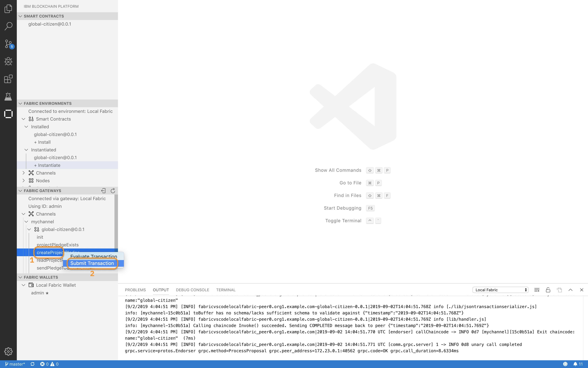

Pass the following arguments to the function and hit Enter.

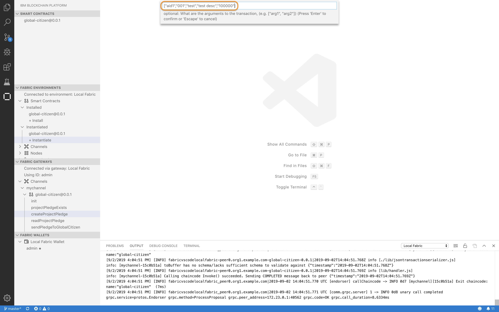

The transaction should complete successfully. Finally, test whether you can read the project pledge by invoking the `readProjectPledge` function. Pass `aid1:001` as pledgeId and check if the response matches the screenshot below.


## 4. Connecting all parts

### Connect the Business Service to the smart contract

The business service communicates with the smart contract via the Hyperledger Fabric SDK. We concentrated all the communication with the blockchain network in the file `blockchainClient.ts`. To include this file in your project as well, copy it from the `hlfabric-lab-code` repo to the `src` folder of your business service.

```
cd ~/Development/blockchain
cp ./hlfabric-lab-code/business-service/src/blockchainCLient.ts ./ibm-tnw2019-bc/src
```

Next, move the `local_fabric` folder from the `hlfabric-lab-code` repo to the root folder of your business service. This folder contains the connection information to your local Hyperledger Fabric network, as well as some JavaScript files to enroll an admin user and a normal user.

```
cd ~/Development/blockchain
mv ./hlfabric-lab-code/business-service/local_fabric ./ibm-tnw2019-bc
```

Now open the blockchain client in Visual Code. An important function in this class is the function `connectToNetwork()`.

```ts
    async connectToNetwork() {

      const gateway = new Gateway();

      try {
        await gateway.connect(ccp, { wallet, identity: appAdmin, discovery: gatewayDiscovery });

        // Connect to our local fabric
        const network = await gateway.getNetwork('mychannel');

        console.log('Connected to mychannel. ');

        // Get the contract we have installed on the peer
        const contract = await network.getContract('global-citizen');

        let networkObj = {
          contract: contract,
          network: network
        };

        return networkObj;

      } catch (error) {
        console.log(`Error processing transaction. ${error}`);
        console.log(error.stack);

        return error;
      }
    }
```

First a connection is made to the gateway using the admin identity of the network (line 30 of the file). Next, an instance of the `mychannel` network is retrieved in line 33. An instance of the contract object is obtained in line 38. Note that in this demo we explicitly look for `global-citizen` as contract name and that this name matches the name of the smart contract that was deployed to the network in part 3 of this pattern. The contract and network are stored in a -- for this purpose created -- object called networkObj. This object is returned to the caller in line 45. 

Once connected to the network, every transaction has its own function in the client. All functions have the same layout. They expect one generic input object, called `args`. This object needs to have an attribute called `contract` and one called `function`. Besides these two args contain all attributes needed to successfully invoke the smart contract transaction. As an example, the `createProjectPledge` function is listed below.

```ts
    async createProjectPledge(args: any) {
      // Calling transaction1 transaction in the smart contract
      let response = await args.contract.submitTransaction(args.function, args.aidOrg, args.pledgeNumber, args.name, args.desc, args.fundsRequired);

      return response;
    }
```

Now all transactions can be invoked via the client, it is time to implement the controller logic. For this, expand the `src/controllers` folder of the `ibm-tnw2019-bc` project and double-click the first controller `create-project-pledge.controller.ts` in the list. It should be opened in Visual Code. Now replace line 23

```ts
throw new Error('Not implemented');
```

with the following code

```ts
     try {
      let networkObj = await blockchainClient.connectToNetwork();

      if (networkObj && !(networkObj.stack)) {
        // Construct data object that serves as
        let inputObj = {
          function: 'createProjectPledge',
          contract: networkObj.contract,
          pledgeNumber: requestBody.pledgeNumber,
          name: requestBody.name,
          desc: requestBody.description,
          fundsRequired: requestBody.fundsRequired,
          aidOrg: requestBody.aidOrg
        };

        await blockchainClient.createProjectPledge(inputObj);
      } else {
        // Couldn't connect to network, so passing this object on to catch clause...
        throw new Error(networkObj.message);
      }

      let responseMessage: ResponseMessage = new ResponseMessage({ message: 'added project pledge' });
      return responseMessage;

    } catch (error) {
      let responseMessage: ResponseMessage = new ResponseMessage({ message: error, statusCode: '400' });
      return responseMessage;
    }
```

You'll probably notice that the blockchainClient variable cannot be resolved. This is because there is no blockchainClient defined in the controller. To define one, type the following line of code above the class definition in the controller.

```ts
let blockchainClient = new BlockChainModule.BlockchainClient();
```

The code should now look like

```ts
/* tslint:disable:no-any */
import { operation, param, requestBody } from '@loopback/rest';
import { CreateProjectPledge } from '../models/create-project-pledge.model';
import { ResponseMessage } from '../models/response-message.model';
import { BlockChainModule } from '../blockchainClient';

let blockchainClient = new BlockChainModule.BlockchainClient();

/**
 * The controller class is generated from OpenAPI spec with operations tagged
 * by CreateProjectPledgeController
 *
 */
export class CreateProjectPledgeController {
  constructor() { }

  :
  :
```

and the errors should have disappeared. Make sure your changes to the controller code are saved. Now repeat this for all other controllers in the folder. Below  the code snippets are listed for each of the controllers.

**project-pledge.controller.ts**
```ts
    try {
      let networkObj = await blockchainClient.connectToNetwork();

      if (networkObj && !(networkObj.stack)) {
        let inputObj = {
          function: 'readProjectPledge',
          contract: networkObj.contract,
          id: id
        };

        return await blockchainClient.queryProject(inputObj);
      } else {
        // Couldn't connect to network, so passing this object on to catch clause...
        throw new Error(networkObj.message);
      }

    } catch (error) {
      return error;
    }
```

**send-pledge-to-global-citizen.controller.ts**
```ts
    try {
      let networkObj = await blockchainClient.connectToNetwork();

      if (networkObj && !(networkObj.stack)) {
        // Construct data object that serves as
        let inputObj = {
          function: 'sendPledgeToGlobalCitizen',
          contract: networkObj.contract,
          pledgeId: requestBody.pledgeId
        };

        await blockchainClient.sendPledgeToGlobalCitizen(inputObj);
      } else {
        // Couldn't connect to network, so passing this object on to catch clause...
        throw new Error(networkObj.message);
      }

      let responseMessage: ResponseMessage = new ResponseMessage({ message: 'Sent project pledge ' + requestBody.pledgeId + ' to citizen org for review...' });
      return responseMessage;

    } catch (error) {
      let responseMessage: ResponseMessage = new ResponseMessage({ message: error, statusCode: '400' });
      return responseMessage;
    }
```

**send-pledge-to-gov-org.controller.ts**
```ts
    try {
      let networkObj = await blockchainClient.connectToNetwork();

      if (networkObj && !(networkObj.stack)) {
        // Construct data object that serves as
        let inputObj = {
          function: 'sendPledgeToGovOrg',
          contract: networkObj.contract,
          pledgeId: requestBody.pledgeId
        };

        await blockchainClient.sendPledgeToGovOrg(inputObj);
      } else {
        // Couldn't connect to network, so passing this object on to catch clause...
        throw new Error(networkObj.message);
      }

      let responseMessage: ResponseMessage = new ResponseMessage({ message: 'Sent project pledge ' + requestBody.pledgeId + ' to government org for review...' });
      return responseMessage;

    } catch (error) {
      let responseMessage: ResponseMessage = new ResponseMessage({ message: error, statusCode: '400' });
      return responseMessage;
    }
```

**transfer-funds.controller.ts**
```ts
    try {
      let networkObj = await blockchainClient.connectToNetwork();

      if (networkObj && !(networkObj.stack)) {
        // Construct data object that serves as
        let inputObj = {
          function: 'transferFunds',
          contract: networkObj.contract,
          pledgeId: requestBody.pledgeId
        };

        await blockchainClient.transferFunds(inputObj);
      } else {
        // Couldn't connect to network, so passing this object on to catch clause...
        throw new Error(networkObj.message);
      }

      let responseMessage: ResponseMessage = new ResponseMessage({ message: 'Total funds received incremented for project pledge ' + requestBody.pledgeId });
      return responseMessage;

    } catch (error) {
      let responseMessage: ResponseMessage = new ResponseMessage({ message: error, statusCode: '400' });
      return responseMessage;
    }
```

**update-pledge.controller.ts**
```ts
    try {
      let networkObj = await blockchainClient.connectToNetwork();

      if (networkObj && !(networkObj.stack)) {
        // Construct data object that serves as
        let inputObj = {
          function: 'updatePledge',
          contract: networkObj.contract,
          pledgeId: requestBody.pledgeId,
          fundingType: requestBody.fundingType,
          approvedFunding: requestBody.approvedFunding,
          fundsPerInstallment: requestBody.fundsPerInstallment
        };

        await blockchainClient.updatePledge(inputObj);
      } else {
        // Couldn't connect to network, so passing this object on to catch clause...
        throw new Error(networkObj.message);
      }

      let responseMessage: ResponseMessage = new ResponseMessage({ message: 'Updated project pledge ' + requestBody.pledgeId });
      return responseMessage;

    } catch (error) {
      let responseMessage: ResponseMessage = new ResponseMessage({ message: error.message, statusCode: '400' });
      return responseMessage;
    }
```
Now, try to run your business service by running `npm start` from the root directory of your service.

```
cd ~/Development/blockchain/ibm-tnw2019-bc
npm start
```

This will fail with the following error message

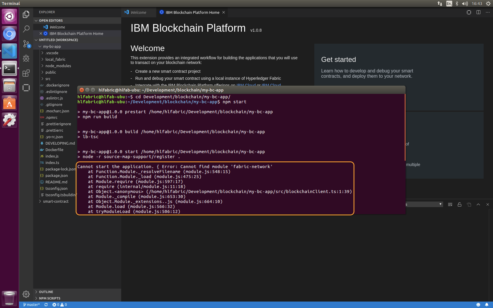

The `fabric-network` module is not added as a dependency yet. To add this module, open the `package.json` file in Visual Code and add the following line to the `devDependencies` section.

```
"fabric-network": "^1.4.0"
```

Now, run `npm install` in the same directory as before -- the root folder of your business service. 

When our blockchain network was started for the first time (in part 3 of this pattern), an admin user was registered with our Certificate Authority. Now we need to send an enroll call to the CA server and retrieve the enrollment certificate (eCert) for this user. We won’t delve into enrollment details here, but stop by saying that the SDK and by extension our applications need this cert in order to form a user object for the admin. This user object (identity) is needed to connect to the Hyperledger Fabric gateway (line 30 in the `blockchainClient.ts` file). 

To enroll the admin user, type the following in the `local_fabric` folder of your business service.

```
cd ~/Development/blockchain/ibm-tnw-2019-bc/local_fabric
node enrollAdmin.js
```

It is time to test the connected business service. For this, start the application by running `npm start` in the root folder of your project (typically `ibm-tnw2019`). The application should successfully start and can be accessed on [http://localhost:3000/explorer](http://localhost:3000/explorer). Now, test all transactions to make sure the controllers are properly implemented and can access the smart contract.

The first test is to create a new project pledge using the parameters as shown in the screenshot below. Remember, to get to the form where you can provide the project pledge details, first click the `CreateProjectPledgeController`. Then, click the POST request `CreateProjectPledge` and finally the 'Try it out' button on the right. The POST request should return with a HTTP 200 OK response message.

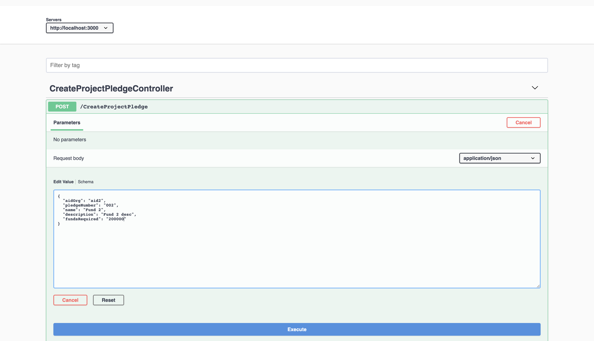

Next, send this project pledge to the citizen organization for review by invoking the `SendPledgeToGlobalCitizenController` function. If you used the parameters from the screenshot above, you should use 'aid2:002' as plegeId.

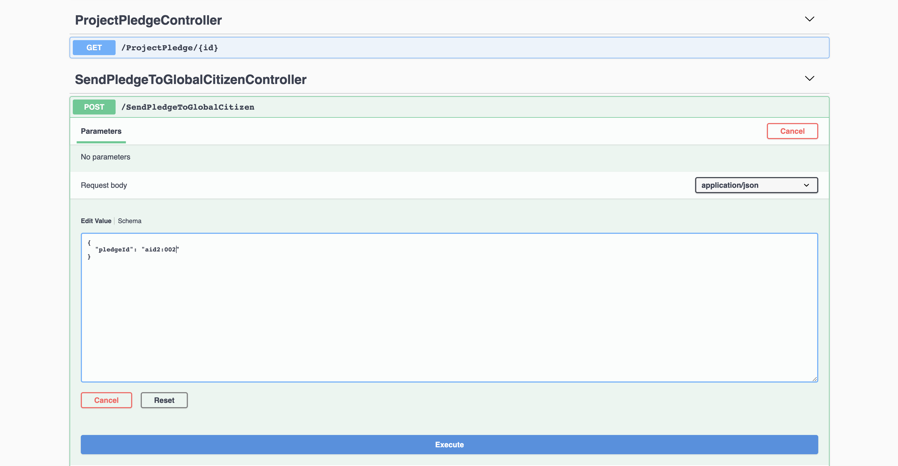

Next, send the project pledge to the government organization. Use the same pledgeId as above.


The government organization can update the pledge with the total fund approved, funding type and the fund installment per transfer. To update the project pledge with these details, invoke the controller with the following parameters...

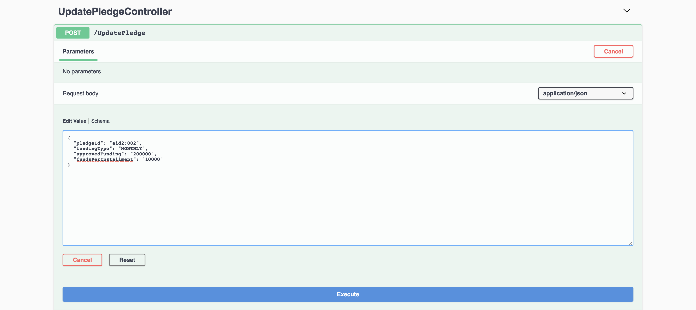

Finally, you can start transferring funds by invoking the `TransferFundsController` controller with `aid2:002` as pledgeId.

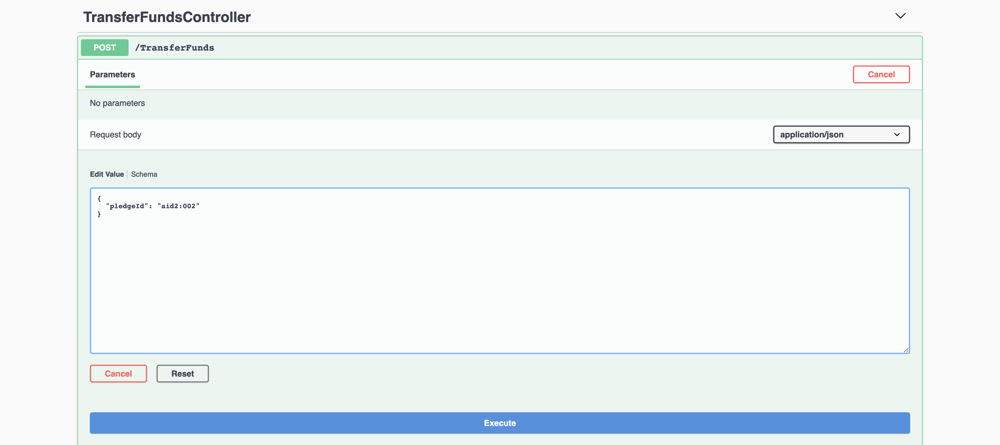

Now query the project pledge by invoking the `ProjectPledgeController` controller. Use the same pledgeId as above. 

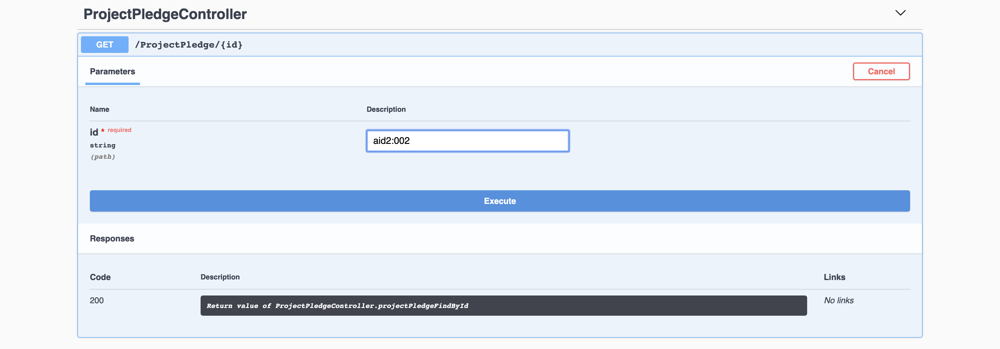

You should see an output similar to

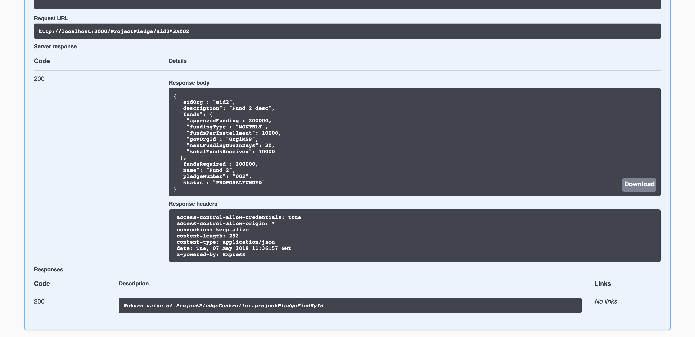

Note the funds object that is part of the project pledge now. If you invoke transferFunds again, followed by the above project pledge query, you should see an increase of the `totalFundsReceived` attribute.

### Connecting the business service to the frontend


