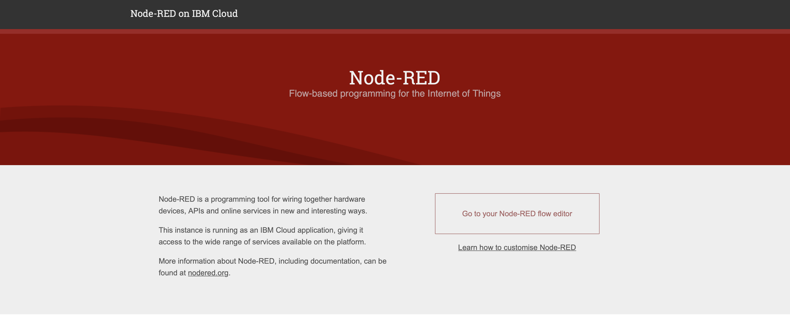
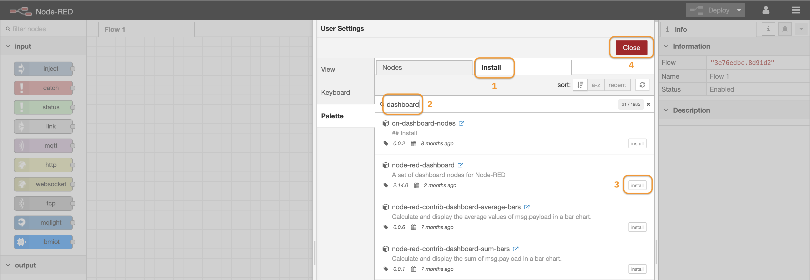

# How blockchain can make a real difference
Imagine if every citizen had the confidence that philanthropic commitments to support societal challenges such as extreme poverty were being honored. That resources were in fact filtering down to the people with the greatest needs. That every dollar donated and spent was making a real impact. Wouldn’t a more transparent system motivate people to more readily champion worthy causes? Or better yet, inspire them to donate more themselves?
Complete this pattern to build a simple blockchain network using Hyperledger Fabric, on which cause-specific pledges and fund transfers are made by the government, registered with aid organizations, and validated by Global Citizen.

Audience level: Intermediate Developers

## Prerequisites

1. Free [IBM Cloud account](https://ibm.biz/Bd2t6h)
2. The VirtualBox image containing Hyperledger Fabric and all other pre-reqs to complete this pattern
3. VirtualBox 6.x

## Overview
The image below gives a high level overview of the scenario described above and will form the basis of our demo application. This idea is taken from the 'Tracking Donations with blockchain' code pattern and modified so that it can also be deployed to the IBM Blockchain Platform V2.0 service

  

The application to support the above process involves a frontend, a business service and a smart contract. The smart contract will have as asset the cause-specific pledge (called the project pledge) and the transactions: `createProjectPledge`, `sendPledgeToGlobalCitizen`, `sendPledgeToGovOrg`, `updatePledge` and `transferFunds`. The business service implements the logic to support the transactions and finally exposes them as RESTful endpoints. The business service communicates with the smart contract via the Hyperledger Fabric SDK. The transaction invoked on the smart contract updates the ledger. All this is depicted in the schematic overview below.

  

As you can see in the image, building this demo application consists of three major steps. The fourth and last step is connecting all parts.

## Steps
1. Build a frontend in Node-RED
2. Build the Business Service
3. Build the Smart Contract
4. Connect all parts

## 1. Build a front-end in Node-RED
Logon to IBM Cloud using the free account you just created. Next, click the 'Catalog' on the top bar (1) and then search for Node-RED (2). Finally, click on the starter kit Node-RED Starter.

  

Give the service a unique name (1) and select a nearby region to deploy to (e.g. London or Frankfurt). Click 'Create' (2) to create the service. 

The deployment takes a couple of minutes to complete, so you might want to move on to part 2 and start the creation of your business service and return later to complete the setup of your frontend.

Once the deployment is successfully completed, visit the app URL by clicking (1) on the image below.

Next, complete the Node-RED initial set-up wizard. Click Next on the first screen and choose a userid/password on the second one to secure your Node-RED environment. Click Next (2) and Next again to go to the final overview page of the wizard. Click Finish to complete it. 

On the welcome page click on the 'Go to your Node-RED flow editor' button.

Login with your Node-RED credentials (the userid/password you specified in the wizard). You are presented with the drawing canvas, that you'll need to create your Node-RED flows. As we are developing a frontend, we need UI nodes. Unfortunately, these are not present by default so we need to add them. For this, click the menu on the top right (1) and select 'Manage palette' (2).

Next, click Install (1) and type 'dashboard' in the search bar. Click Install (3) to start the installation of the Node-RED dashboard nodes. 

Once the installation successfully completes, click 'Close' to close the palette. The dashboard nodes are available to you as a separate section on the left-hand side. You might need to scroll down to see them.

For now, this completes the first step. You just created a Node-RED application on IBM Cloud that serves as frontend and that is ready to consume some REST services...

## 2. 
